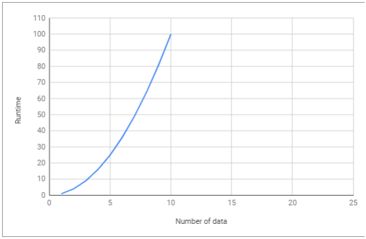

## **Penjelasan Sederhana Tentang Time Complexity dan Big-O Notation**

Setiap programmer yang baik akan menggunakan cara yang paling efektif dan efisien dalam menyelesaikan suatu permasalahan. Dan untuk bisa melakukan hal tersebut, <b>kita harus bisa meminimalisir kompleksitas dari algoritma yang kita gunakan.</b>

Kompleksitas suatu algoritma dibagi menjadi 2, yaitu <i><b>Time Complexity</i></b> dan <i><b>Space Complexity.</i></b>

<b>Time Complexity</b> adalah seberapa lama waktu yang diperlukan untuk menjalankan suatu algoritma. Sedangkan <b>Space Complexity</b> adalah seberapa besar memori yang kita gunakan untuk menjalankan suatu algoritma. Dan disini kita hanya akan membahas tentang <b>Time Complexity.</b>

### **Algoritma**
Sebelum kita melanjutkan pembahasan, kita harus mengerti dulu apa itu <b>algoritma/fungsi.</b>

Sederhananya, algoritma adalah serangkaian proses yang dilakukan secara berurutan untuk menyelesaikan sebuah permasalahan. Algoritma bisa bermacam-macam tergantung kepada siapa yang membuat algoritma tersebut. Namun permasalahannya adalah <b><i>algoritma mana yang lebih efektif dan efisien?</b></i>

<b>Time Complexity Analysis</b> adalah suatu cara sederhana untuk mengetahui berapa lama waktu yang dibutuhkan untuk menjalankan suatu algoritma dengan input tertentu (n). Biasanya lebih dikenal dengan sebutan Big-O Notation.

### **So, What’s Big-O Notation?**

<b>Big-O Notation</b> adalah cara untuk mengkonversi keseluruhan langkah-langkah suatu algoritma kedalam bentuk <b>Aljabar</b>, yaitu dengan menghiraukan konstanta yang lebih kecil dan koefisien yang tidak berdampak besar terhadap keseluruhan kompleksitas permasalahan yang diselesaikan oleh algoritma tersebut.

Mari kita liat contoh dibawah ini:

 Regular       Big-O
 2             O(1)   --> It's just a constant number

 2n + 10       O(n)   --> n has the largest effect

 5n^2          O(n^2) --> n^2 has the largest effect

Sederhananya, semua contoh yang ada diatas mengatakan bahwa <i><b>“kita hanya akan melihat faktor yang memiliki dampak paling besar terhadap nilai yang dihasilkan oleh algoritma tersebut”.</i></b>

Terdapat beberapa macam time complexity, diantaranya:
### **O(1) — Constant Time**

<b>Constant Time</b> artinya banyaknya input yang diberikan kepada sebuah algoritma, tidak akan mempengaruhi waktu proses (runtime) dari algoritma tersebut.

 let myArray = [1, 5, 0, 6, 1, 9, 9, 2];

 function getFirst(input){

    return input[0]; // selalu melakukan 1 langkah
 }

 let firstEl = getFirst(myArray);

 Contoh diatas, terdapat sebuah fungsi untuk mengambil elemen pertama dari sebuah input array. Kita bisa melihat bahwa berapapun jumlah array yang diberikan kepada fungsi tersebut, dia akan selalu melakukan 1 hal, yaitu mengambil elemen pertama. Itu artinya <b>jumlah input yang diberikan tidak mempengaruhi waktu proses (runtime) dari algoritma tersebut.</b>

Constant Time

### **O(log n) — Logarithmic Time**

<b>Logarithmic Time</b> artinya ketika kita memberikan input sebesar n terhadap sebuah fungsi, jumlah tahapan yang dilakukan oleh fungsi tersebut berkurang berdasarkan suatu faktor. Salah satu contohnya adalah <b>algoritma Binary Search.</b>

    let sortedArray = [11, 24, 30, 43, 51, 61, 73, 86];
    function isExists(number, array){
    var midPoint = Math.floor( array.length /2 );
    if( array[midPoint] === num) return true;
    let isFirstHalf = false;
    if( array[midPoint] < num ) isFirstHalf = true;
  
    else if( array[midpoint] > num ) isFirstHalf = false;
    if (array.length == 1) return false;
    else { 
        // memanggil fungsi yang sama dengan mengeleminiasi setengah dari input array
        if (isFirstHalf) 
            return isExists(number, getFirstHalf(array));
        else 
            return isExists(number, getSecondHalf(array));
        }
    }
    isExists (24, sortedArray); // return true
    isExists (27, sortedArray); // return false

### **O(n) — Linear Time**
<b>Linear Time</b> adalah ketika runtime dari fungsi kita berbanding lurus dengan jumlah input yang diberikan.

    let myArray = [1, 5, 0, 6, 1, 9, 9, 2];
        function getMax(input){
        var max = 0;
        for (var i=0; i<input.length; i++){
            if (max < input[i])
                max = input[i];
        }
        return max;
    }
    let maxNumber = getMax(myArray);

Kita bisa melihat bahwa <b>semakin banyak jumlah input yang diberikan, maka waktu proses/runtime dari fungsi tersebut akan semakin besar.</b>

Linear Time

### **O(n²) — Quadratic Time**

<b>Quadratic Time</b> adalah ketika runtime dari fungsi kita adalah sebesar n^2, dimana n adalah jumlah input dari fungsi tersebut. Hal tersebut bisa terjadi karena kita menjalankan <b>fungsi linear didalam fungsi linear</b> (n*n).

    let myArray = [1, 5, 0, 6, 1, 9, 9, 2];
    function sort(input){
        var sortedArray = [];
        for (var i=0; i<input.length; i++){ // O(n)
            let min = input[i];
            for (var j=i+1; i<input.length; i++){ // O(n)
                if (input[i] < input[j])
                    min = input[j];
            }
            sortedArray.push(min);
        }
        return sortedArray;
    }
    let sortedArray = sort(myArray);

Quadric Time

### **O(2^n) — Exponential Time**

<b>Exponential Time</b> biasanya digunakan dalam situasi dimana kita tidak terlalu tahu terhadap permasalahan yang dihadapi, sehingga mengharuskan kita mencoba setiap <b>kombinasi</b> dan <b>permutasi</b> dari semua kemungkinan.

Exponential Time

### **Kesimpulan**

Sebagai programmer, kita sering kali dihadapkan dengan adanya beberapa solusi untuk sebuah permasalahan dan kita dibingungkan dengan pertanyaan <i><b>“mana solusi yang lebih efisien?”.</i></b>

Dengan memahami <b>Big-O Notation</b>, kita akan lebih mudah dalam melihat mana algoritma yang lebih efisien yang bisa kita gunakan untuk menyelesaikan permasalahan yang sedang dihadapi.